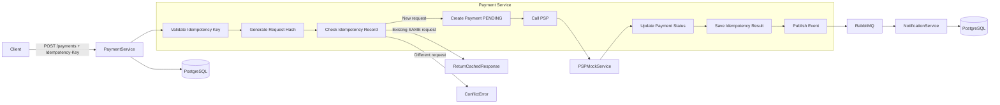

# RabbitMQ Idempotent Payment Case Study

This repository demonstrates a practical Event-Driven Architecture scenario for handling **idempotent payment processing** using **RabbitMQ** and **Spring Boot** microservices.

The focus is on solving real-world production problems such as:

  - Duplicate payment requests
  - Network retries
  - Concurrent requests
  - External PSP delays and timeouts

## Overview

The system consists of three microservices:

- **payment-service**
  - handles payment creation
  - implements idempotency logic
  - stores data in **PostgreSQL**
  - publishes payment event to RabbitMQ:
    - `PaymentCompletedEvent`

- **psp-mock-service**
  - simulates external payment provider
  - supports success / failure / timeout

- **notification-service**
  - consumes payment events
  - stores notification data in **PostgreSQL**
  - consumes payment events from RabbitMQ:
	- `PaymentCompletedEvent`

---

## 🏗️ Architecture Diagram



---

## 🔄 Event Flow

### Payment Creation Flow

1. The client sends a request to create a payment with an `Idempotency-Key`.
2. `payment-service` validates the key and generates a request hash.
3. The system checks if an idempotency record already exists:
   - If same request → return cached response
   - If different request → return `409 Conflict`
   - If new request → proceed
4. A payment record is created with status `PENDING`.
5. `payment-service` calls the external PSP (`psp-mock-service`).
6. Based on PSP response:
   - SUCCESS → payment marked as `COMPLETED`
   - FAILURE → payment marked as `FAILED`
   - TIMEOUT → handled accordingly
7. The final response is stored in the idempotency table.
8. A `PaymentCompletedEvent` is published to RabbitMQ.
9. `notification-service` consumes the event and stores notification data.

---

## 🔁 Idempotency Request Scenarios

### New Request

- New `Idempotency-Key`
- Payment is processed normally
- Response is stored for future reuse

---

### Retry (Same Request)

- Same key + same request body
- Cached response is returned
- ❌ No duplicate processing

---

### Conflict

- Same key + different request body
- Request hash mismatch detected
- ❌ `409 Conflict` returned

---

### Concurrent Request

- Two requests with the same key arrive simultaneously
- Only one request is processed
- The other is rejected or safely handled

---

### PSP Delay / Timeout

- External PSP responds slowly or times out
- Client retries using same key
- System ensures no duplicate payment is created

---

## ⚠️ Failure Scenarios

This project simulates real-world failure conditions that commonly occur in distributed systems.

### 1. Network Timeout

- PSP call times out
- Client retries the same request with the same `Idempotency-Key`
- System returns cached result or continues processing safely

---

### 2. Duplicate Requests

- Same request sent multiple times due to retries
- Idempotency ensures:
  - no duplicate payment processing
  - same response returned

---

### 3. Concurrent Requests

- Two requests with the same key arrive simultaneously
- Only one is processed
- The other is rejected or handled safely

---

### 4. Conflict Scenario

- Same `Idempotency-Key` but different request body
- System detects mismatch via request hash
- Returns `409 Conflict`

---

### 5. PSP Delay / Late Response

- External PSP responds late
- System ensures consistent state using stored idempotency records

---

## Tech Stack

- Java 21
- Spring Boot 4
- Spring Data JPA
- RabbitMQ
- PostgreSQL
- Docker Compose
- JUnit 5
- Testcontainers
- MapStruct
- Lombok

---

## Project Structure

```text
rabbitmq-idempotent-payment-case-study/
├── README.md
├── rabbitmq-idempotent-payment-case-study.postman_collection.json
├── k8s/
├── notification-service/
├── payment-service/
└── psp-mock-service/
```

---

## Running the Project

Make sure Docker Desktop and Kubernetes are installed and running.

From the root folder of the project, run:

```bash
docker build -t payment-service:latest ./payment-service
docker build -t psp-mock-service:latest ./psp-mock-service
docker build -t notification-service:latest ./notification-service
```

If your Kubernetes cluster is using Minikube with Docker driver, point your shell to Minikube Docker environment before building:
```bash
minikube docker-env
```

---

## 🚀 Running the Project

This project is designed to run on **Kubernetes (Minikube)** using pre-configured YAML manifests.

---

### 📦 Prerequisites

Make sure the following tools are installed:

- Docker Desktop
- Minikube
- kubectl
- Java 21
- Maven

---

### 1. Start Minikube

```bash
minikube start
```

Verify cluster:

```bash
kubectl get nodes
```

### 2. Configure Docker Environment (Important)
If using Minikube with Docker driver, point your shell to Minikube’s Docker daemon:

Linux / Mac

```bash
eval $(minikube docker-env)
```

Windows (PowerShell)

```bash
& minikube -p minikube docker-env --shell powershell | Invoke-Expression
```

### 3. Build Docker Images

```bash
docker build -t payment-service:latest ./payment-service
docker build -t psp-mock-service:latest ./psp-mock-service
docker build -t notification-service:latest ./notification-service
```

### 4. Deploy to Kubernetes

```bash
kubectl apply -f k8s/
```

### 5. Verify Deployment

Check pods:

```bash
kubectl get pods -n rabbitmq-idempotency
```

Check services:

```bash
kubectl get svc -n rabbitmq-idempotency
```

### 6. Access the Services

Option 1: Port Forward

```bash
kubectl port-forward svc/payment-service 7071:7071 -n rabbitmq-idempotency
kubectl port-forward svc/psp-mock-service 7072:7072 -n rabbitmq-idempotency
kubectl port-forward svc/notification-service 7073:7073 -n rabbitmq-idempotency
```
Note: Run each command in a separate terminal window.

Option 2: Minikube Service

```bash
minikube service payment-service -n rabbitmq-idempotency
minikube service psp-mock-service -n rabbitmq-idempotency
minikube service notification-service -n rabbitmq-idempotency
```
Note: Run each command in a separate terminal window.
When the browser opens, copy the URL from the address bar and use it as the base URL for your requests.


### 7. Trace the Logs

You can trace application logs using the following commands:

#### payment-service logs

```bash
kubectl logs deployment/payment-service -n rabbitmq-idempotency
```

#### psp-mock-service logs

```bash
kubectl logs deployment/psp-mock-service -n rabbitmq-idempotency
```

#### notification-service logs

```bash
kubectl logs deployment/notification-service -n rabbitmq-idempotency
```

#### RabbitMQ logs

```bash
kubectl logs deployment/rabbitmq -n rabbitmq-idempotency
```

#### Follow logs continuously

```bash
kubectl logs deployment/payment-service -n rabbitmq-idempotency -f
kubectl logs deployment/psp-mock-service -n rabbitmq-idempotency -f
kubectl logs deployment/notification-service -n rabbitmq-idempotency -f
kubectl logs deployment/rabbitmq -n rabbitmq-idempotency -f
```

### 8. Stop/Remove K8s Components

To remove everything:

```bash
kubectl delete -f k8s/
```

To stop Minikube:

```bash
minikube stop
```

---

## Service URLs

### payment-service

Base URL:

```text
http://localhost:7071
```

### psp-mock-service

Base URL:

```text
http://localhost:7072
```

### notification-service

Base URL:

```text
http://localhost:7073
```

### RabbitMQ Management UI

```text
http://localhost:15672
```

Default credentials:

```text
username: guest
password: guest
```

---

## API Endpoints

### Payment Service Endpoints

Create Payment

```http
POST /api/v1/payments
```

Get Payment By Id

```http
GET /api/v1/payments/{id}
```

Get All Payments

```http
GET /api/v1/payments
```

Get All IdempotencyRecords

```http
GET /api/v1/idempotencyRecords
```

### PSP Mock Service Endpoints

Process PSP Mock Payment

```http
POST /api/v1/psp/payments
```


### Notification Service Endpoints

Get All Notifications

```http
GET /api/v1/notifications
```

---

## 🧪 Curl Samples

### payment-service

#### Create Payment [SUCCESS]

```bash
curl --location 'http://localhost:7071/api/v1/payments' \
--header 'Idempotency-Key: SOME_KEY' \
--header 'Content-Type: application/json' \
--data '{
    "invoiceId": "INV-001",
    "customerId": "CST-001-A",
    "amount": 500,
    "currency": "USD",
    "pspScenario": "SUCCESS"
}'
```

#### Create Payment [DELAYED_SUCCESS]

```bash
curl --location 'http://localhost:7071/api/v1/payments' \
--header 'Idempotency-Key;' \
--header 'Content-Type: application/json' \
--data '{
    "invoiceId": "INV-002",
    "customerId": "CST-002-A",
    "amount": 350,
    "currency": "USD",
    "pspScenario": "DELAYED_SUCCESS"
}'
```

#### Create Payment [TIMEOUT]

```bash
curl --location 'http://localhost:7071/api/v1/payments' \
--header 'Idempotency-Key;' \
--header 'Content-Type: application/json' \
--data '{
    "invoiceId": "INV-003",
    "customerId": "CST-003-B",
    "amount": 800,
    "currency": "USD",
    "pspScenario": "TIMEOUT"
}'
```

#### Get Payments By ID

```bash
curl --location 'http://localhost:7071/api/v1/payments/9caaec9b-09b6-400e-8f7b-53378db93c40'
```

#### Get All Payments

```bash
curl --location 'http://localhost:7071/api/v1/payments'
```

### psp-mock-service

#### Process PSP Mock Payment [SUCCESS]

```bash
curl --location 'http://localhost:7072/api/v1/psp/payments' \
--header 'Content-Type: application/json' \
--data '{
    "invoiceId": "INV-001",
    "customerId": "CST-001-A",
    "amount": 500,
    "currency": "USD"
}'
```

#### Process PSP Mock Payment [DELAYED_SUCCESS]

```bash
curl --location 'http://localhost:7072/api/v1/psp/payments' \
--header 'X-PSP-Scenario: DELAYED_SUCCESS' \
--header 'Content-Type: application/json' \
--data '{
    "invoiceId": "INV-002",
    "customerId": "CST-002-A",
    "amount": 350,
    "currency": "USD"
}'
```

#### Process PSP Mock Payment [TIMEOUT]

```bash
curl --location 'http://localhost:7072/api/v1/psp/payments' \
--header 'X-PSP-Scenario: TIMEOUT' \
--header 'Content-Type: application/json' \
--data '{
    "invoiceId": "INV-003",
    "customerId": "CST-003-B",
    "amount": 800,
    "currency": "USD"
}'
```


### notification-service

#### Get All Notifications

```bash
curl --location 'http://localhost:7073/api/v1/notifications'
```

---

## Postman Collection

A ready-to-use Postman collection is included in the repository:

```text
rabbitmq-idempotent-payment-case-study.postman_collection.json
```

You can import it directly into Postman and test the full flow.

---

## Testing

The project contains automated tests, including:

- unit tests for service layer logic
- unit tests for consumer delegation behavior
- integration tests for controller endpoints
- Testcontainers-based tests for database-backed integration scenarios

This helps validate the behavior in an environment closer to real infrastructure.

---

## ❓ Why Idempotency is Critical in Payments

In real-world payment systems:

- Clients may retry requests due to:
  - network issues
  - timeouts
  - UI double-clicks
- Payment gateways may respond slowly or unpredictably

Without idempotency:

- Duplicate payments may occur
- Financial inconsistencies may arise
- Reconciliation becomes complex

Idempotency ensures that:

> The same request produces the same result — no matter how many times it is repeated.